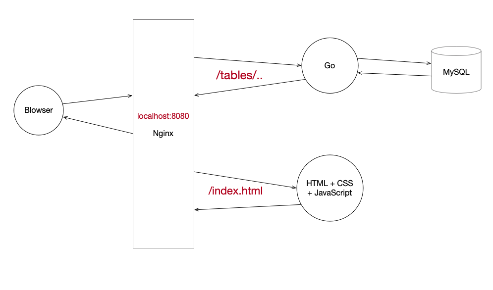

## 数据库实验三

### 题目

> 建立以下相关数据的数据库，并用一个页面显示所有的表名，即要求用户点击该表名显示出该表所有记录。并完成插入记录，删除记录以及修改记录的功能。
>
>    注:所有的思考题均要求网页代码和运行后的界面。注意界面设计及美观性。

```mysql
Use the following SQL DDL statements to create the six tables required for this project. Note that you need to use the exact statements as shown below to ensure that the instructor can test your programs using the instructor’s data later. Please also note that the tables are created in certain order such that by the time when a foreign key needs to be created, the corresponding primary key has already been created.

create table employees
(
	eid varchar(3) not null,
	ename varchar(15),
	city varchar(15),
	primary key(eid)
);
      
create table customers
(
	cid varchar(4) not null,
	cname varchar(15),
	city varchar(15),
	visits_made int(5),
	last_visit_time datetime,
	primary key(cid)
);

create table suppliers
(
	sid varchar(2) not null,
	sname varchar(15) not null,
	city varchar(15),
	telephone_no char(10),
	primary key(sid),	
	unique(sname)
);

create table products
(
	pid varchar(4) not null,
	pname varchar(15) not null,
	qoh int(5) not null,
	qoh_threshold int(5),
	original_price decimal(6,2),
	discnt_rate decimal(3,2),
	sid varchar(2),
	primary key(pid),	
	foreign key (sid) references suppliers (sid)
);

create table purchases
(
	purid int not null,
	cid varchar(4) not null,
	eid varchar(3) not null,
	pid varchar(4) not null,
	qty int(5),
	ptime datetime,
	total_price decimal(7,2),
	primary key (purid),
	foreign key (cid) references customers(cid),
	foreign key (eid) references employees(eid),
	foreign key (pid) references products(pid)
);

create table logs
(
	logid int(5) not null auto_increment,
	who varchar(10) not null,
	time datetime not null,
	table_name varchar(20) not null,
	operation varchar(6) not null,
	key_value varchar(4),
	primary key (logid)
);

insert into employees values ('e00', 'Amy', 'Vestal');
insert into employees values ('e01', 'Bob', 'Binghamton');
insert into employees values ('e02', 'John', 'Binghamton');
insert into employees values ('e03', 'Lisa', 'Binghamton');
insert into employees values ('e04', 'Matt', 'Vestal');

insert into suppliers values ('s0', 'Supplier 1', 'Binghamton', '6075555431');
insert into suppliers values ('s1', 'Supplier 2', 'NYC', '6075555432');

insert into products values ('pr00', 'Milk', 12, 10, 2.40, 0.1, 's0');
insert into products values ('pr01', 'Egg', 20, 10, 1.50, 0.2, 's1');
insert into products values ('pr02', 'Bread', 15, 10, 1.20, 0.1, 's0');
insert into products values ('pr03', 'Pineapple', 6, 5, 2.00, 0.3, 's0');
insert into products values ('pr04', 'Knife', 10, 8, 2.50, 0.2, 's1');
insert into products values ('pr05', 'Shovel', 5, 5, 7.99, 0.1, 's0');

insert into customers values ('c000', 'Kathy', 'Vestal', 2, '2017-11-28 10:25:32'); 
insert into customers values ('c001', 'Brown', 'Binghamton', 1, '2017-12-05 09:12:30'); 
insert into customers values ('c002', 'Anne', 'Vestal', 1, '2018-11-29 14:30:00'); 
insert into customers values ('c003', 'Jack', 'Vestal', 1, '2018-12-04 16:48:02'); 
insert into customers values ('c004', 'Mike', 'Binghamton', 1, '2018-11-30 11:52:16'); 
    
insert into purchases values (1, 'c000', 'e00', 'pr00', 1, '2018-10-22 12:34:22', 2.16);
insert into purchases values (2, 'c001', 'e03', 'pr03', 2, '2018-12-05 09:12:30', 2.80);
insert into purchases values (3, 'c002', 'e03', 'pr00', 1, '2018-11-29 14:30:00', 2.16);
insert into purchases values (4, 'c000', 'e01', 'pr01', 5, '2018-11-28 10:25:32', 6.00);
insert into purchases values (5, 'c004', 'e04', 'pr02', 3, '2018-11-30 11:52:16', 3.24);
insert into purchases values (6, 'c003', 'e02', 'pr05', 1, '2018-12-04 16:48:02', 7.19);
```


### 解决方案

> 最简单的方式莫过于MySQL + PHP + HTML + CSS，直接通过PHP连接数据库把查询到的结果嵌入进HTML里面。但这样的话前后端代码相互嵌套，实属难看，而且个人对PHP不太感冒，同时想了解一下新兴语言Go，这里后端采用了**gin+gorm编写RESTful API对外接口**，前端则用经典的**HTML+CSS+JavaScript**。


### 整体架构



> 为了解决浏览器的同源策略问题，这里通过Nginx反向代理了前端服务器和后端服务器。
>
> 浏览器访问localhost:8080/会定位到前端的静态目录，前端Javascript则通过localhost:8080/tables/这个字域名获取api数据
>
> **具体细节请查看对应目录下的REAME.md**

### Nginx的配置：

```bash
 server {
        listen       8080;
        server_name  localhost;

        location / {
            # root   html;
            # index  index.html index.htm;
            # 前端打包后的静态目录
            alias /YourRoot/MysqlEX3/WebView/src/;
            # 解决页面刷新404问题
            # try_files $uri $uri/ /index.html;
        }

        location /tables {
            # 后端Go服务器地址
            proxy_pass http://localhost:60055/tables;
        }

        
        error_page   500 502 503 504  /50x.html;
        location = /50x.html {
            root   html;
        }
    }
```

